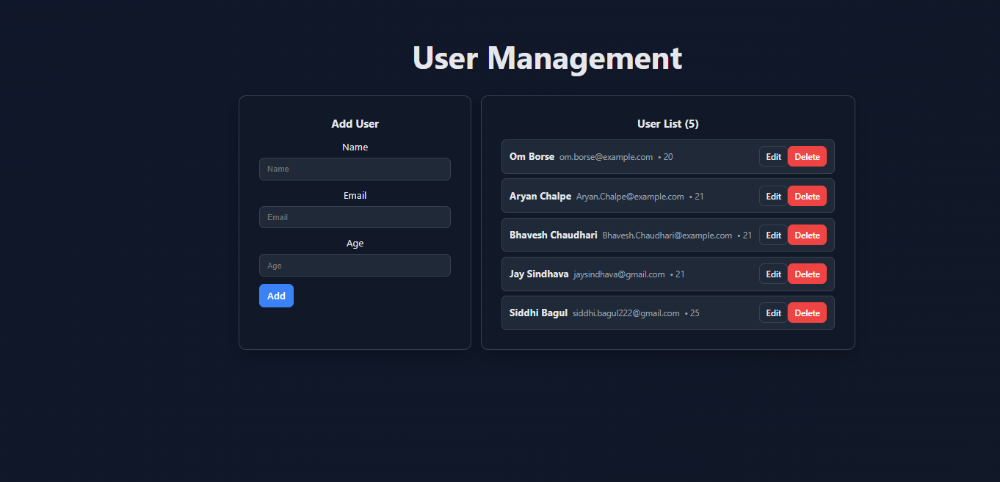

# User Management — Full Stack (Spring Boot + MongoDB + React/Vite)

A minimal full‑stack CRUD app: Spring Boot + MongoDB backend and React (Vite) frontend.

## Stack
- Backend: Java, Spring Boot, MongoDB, Gradle
- Frontend: React 18, Vite, Axios
- Dev tools: Node.js, npm

## Repository Structure
~~~text
.
├─ client/                  # React (Vite) frontend
├─ src/                     # Spring Boot sources
├─ build.gradle / gradlew   # Gradle build files
├─ Images/React_UI.png      # UI screenshot
└─ Readme.md                # This file
~~~

## Prerequisites
- Java 17\+
- Node.js 18\+ and npm
- MongoDB running locally (or a connection URI)

## Backend (Spring Boot)
You can configure via env vars or properties.

- Option A — Environment variables (PowerShell):
~~~powershell
# From project root
$env:SERVER_PORT="8081"
$env:SPRING_DATA_MONGODB_URI="mongodb://localhost:27017/userdb"
.\gradlew bootRun
~~~

- Option B — Properties file:
  Edit `src/main/resources/application.properties`:
~~~properties
server.port=8081
spring.data.mongodb.uri=mongodb://localhost:27017/userdb
~~~

Then run:
~~~powershell
.\gradlew bootRun
~~~

The API will be available at `http://localhost:8081`.

## Frontend (React + Vite)
1. Install dependencies:
~~~powershell
cd client
npm install
~~~

2. Dev environment variables:
   Create `client/.env.development`:
~~~ini
VITE_APP_NAME=User Management UI
VITE_API_BASE=/api
VITE_DEV_PORT=5173
~~~

3. Vite dev server with proxy:
   Ensure `client/vite.config.js` has a proxy to the backend:
~~~javascript
import { defineConfig, loadEnv } from 'vite'
import react from '@vitejs/plugin-react'

export default defineConfig(({ mode }) => {
  const env = loadEnv(mode, process.cwd(), '')
  const port = Number(env.VITE_DEV_PORT ?? 5173)
  return {
    plugins: [react()],
    server: {
      port,
      proxy: {
        '/api': {
          target: 'http://localhost:8081',
          changeOrigin: true,
          secure: false
        }
      }
    }
  }
})
~~~

4. Start the frontend:
~~~powershell
npm run dev
~~~
Open `http://localhost:5173`. Use API calls like `GET /api/users` so the proxy forwards to the backend.

## Production Builds
- Backend:
~~~powershell
.\gradlew build
~~~

- Frontend:
~~~powershell
cd client
npm run build
# Output in client/dist
~~~

Optional preview of the built frontend:
~~~powershell
npm run preview
~~~

## API Contract (expected)
- `GET /api/users` — list users
- `POST /api/users` — create user
- `PUT /api/users/{id}` — update user
- `DELETE /api/users/{id}` — delete user

## Common Issues
- Port in use:
    - Change `server.port` or `VITE_DEV_PORT`.
- CORS:
    - Use the Vite proxy (`/api`) during dev; for direct cross‑origin access, configure Spring CORS.
- Env not loaded:
    - Vite reads only `VITE_*` vars; ensure they are in `client/.env.*`.

## Scripts Summary
- Backend: `gradlew bootRun`, `gradlew build`
- Frontend: in `client` — `npm run dev`, `npm run build`, `npm run preview`

## Notes
- Keep the screenshot at `Images/React_UI.png` or adjust the image path above.
- In production, host the built frontend from any static server or integrate it into Spring Boot if desired.
