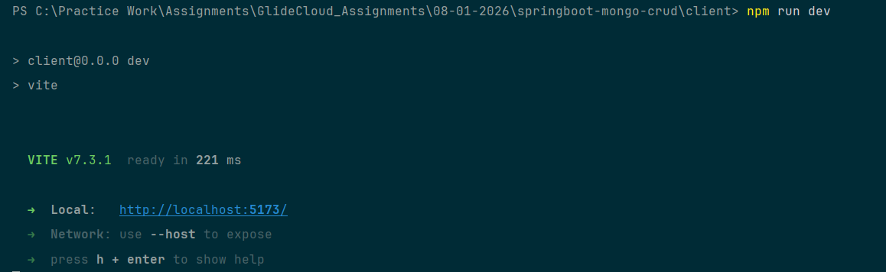
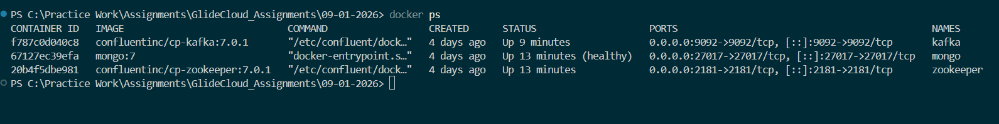
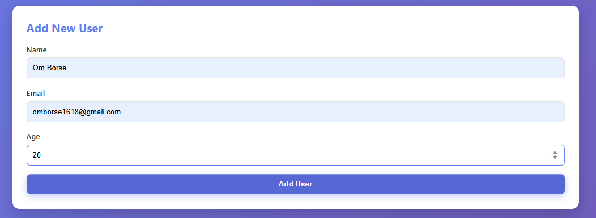
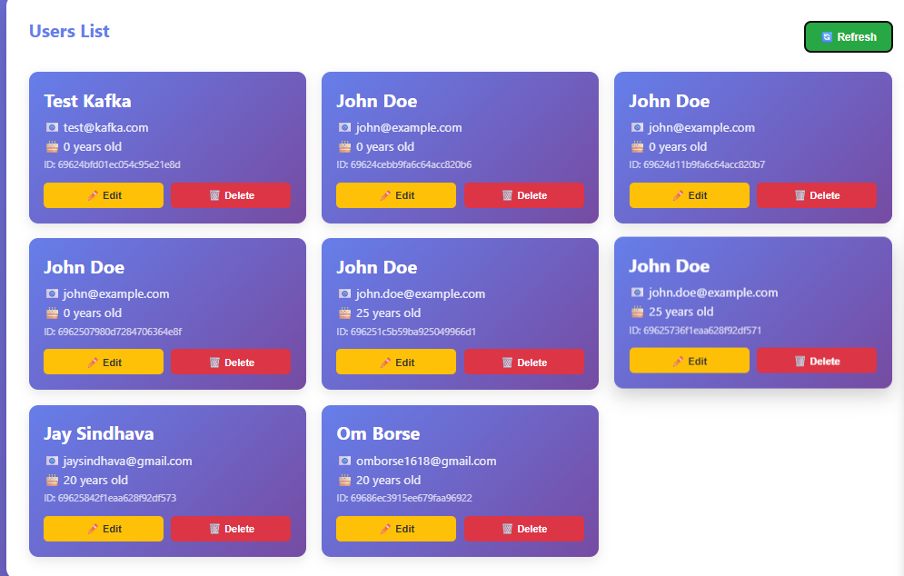
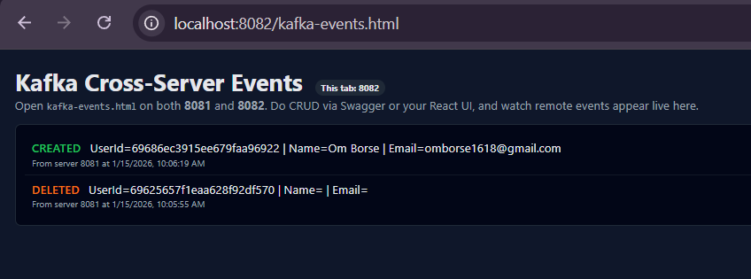

# User Management — Spring Boot + MongoDB + React (Vite) + Kafka (Multi-Instance Demo)

A full-stack CRUD application with:

- Spring Boot REST API + MongoDB persistence
- React (Vite) UI
- Kafka integration to demonstrate cross-server event propagation when the same Spring Boot app runs as two instances (8081 + 8082)

## Screenshots

### React UI




### Swagger / API


### Kafka Demo






### Docker


## What this project demonstrates

### Standard CRUD

The backend exposes `/api/users` endpoints to create, read, update, and delete users stored in MongoDB.

### Kafka cross-server events (8081 ↔ 8082)

When you run the same Spring Boot app twice (server1 on 8081 and server2 on 8082), each instance:

- publishes Kafka events after CRUD writes (created/updated/deleted)
- consumes events produced by the other instance
- forwards those remote events to the browser using Server-Sent Events (SSE)

This is useful to visualize how Kafka helps distribute events across multiple running instances without them calling each other directly.

## Repository structure

```text
.
├─ src/                     # Spring Boot backend
├─ client/                  # React (Vite) frontend
├─ docker-compose.yml       # MongoDB + Kafka + Zookeeper
├─ build.gradle / gradlew   # Gradle build
└─ Images/                  # Screenshots used in this README
```

## Prerequisites

- Java 21 (as configured in Gradle toolchain)
- Node.js 18+ and npm
- Docker Desktop (recommended for MongoDB + Kafka)

## Quick start (recommended: Docker for Mongo + Kafka)

From the project root:

```powershell
docker-compose up -d
```

This starts:

- MongoDB on `localhost:27017`
- Kafka on `localhost:9092`
- Zookeeper on `localhost:2181`

## Run the backend (single instance)

If you only want one backend instance:

```powershell
./gradlew bootRun
```

Then open:

- API base: `http://localhost:8081`
- Swagger UI: `http://localhost:8081/swagger-ui.html`

## Run the Kafka multi-instance demo (two backend instances)

Start the two Spring Boot instances using profiles.

Terminal 1 (Server 1 on 8081):

```powershell
./gradlew bootRun --args='--spring.profiles.active=server1'
```

Terminal 2 (Server 2 on 8082):

```powershell
./gradlew bootRun --args='--spring.profiles.active=server2'
```

Profile configs:

- `src/main/resources/application-server1.properties` (port 8081, Kafka group for server1)
- `src/main/resources/application-server2.properties` (port 8082, Kafka group for server2)

## Run the frontend (React + Vite)

```powershell
cd client
npm install
npm run dev
```

Typical dev URL: `http://localhost:5173`

### Vite proxy note

Your UI should call the backend using `/api/...` so Vite can proxy to the backend during development.
Update `client/vite.config.js` to point to whichever backend you want to use (8081 or 8082).

## Kafka Events page (SSE visualization)

The backend exposes an SSE endpoint:

- `GET /api/events/stream`

There is also a static page in Spring Boot static resources:

- `http://localhost:8081/kafka-events.html`
- `http://localhost:8082/kafka-events.html`

Suggested demo:

1. Open `kafka-events.html` on both ports (two browser tabs)
2. Perform CRUD via Swagger UI or the React UI on one server
3. Watch the other server’s tab receive live events

## API endpoints

- `GET /api/users` — list users
- `POST /api/users` — create user
- `GET /api/users/{id}` — get user
- `PUT /api/users/{id}` — update user
- `DELETE /api/users/{id}` — delete user

## CORS (why it exists here)

When you run multiple ports (8081, 8082, 5173, 5174), the browser treats them as different origins.
`CorsConfig` allows those origins to call `/api/**` so you can:

- use Swagger UI on 8081 to call APIs on 8082 (and vice versa)
- use the React dev server on 5173/5174 to call either backend

## Testing the Kafka demo (PowerShell examples)

Create user on 8081:

```powershell
$response = Invoke-RestMethod -Uri http://localhost:8081/api/users -Method Post -Headers @{"Content-Type"="application/json"} -Body '{"name":"John Doe","email":"john@example.com"}'
$response
```

Update on 8082:

```powershell
$userId = $response.id
Invoke-RestMethod -Uri "http://localhost:8082/api/users/$userId" -Method Put -Headers @{"Content-Type"="application/json"} -Body '{"name":"Jane Doe","email":"jane@example.com"}'
```

Delete on 8081:

```powershell
Invoke-RestMethod -Uri "http://localhost:8081/api/users/$userId" -Method Delete
```

## Troubleshooting

- Kafka not running: ensure `docker-compose up -d` is up and `localhost:9092` is reachable.
- Ports already in use: change `server.port` or stop the other process.
- CORS errors: ensure you’re calling `/api/**` and the origin you’re using is listed in `CorsConfig`.
